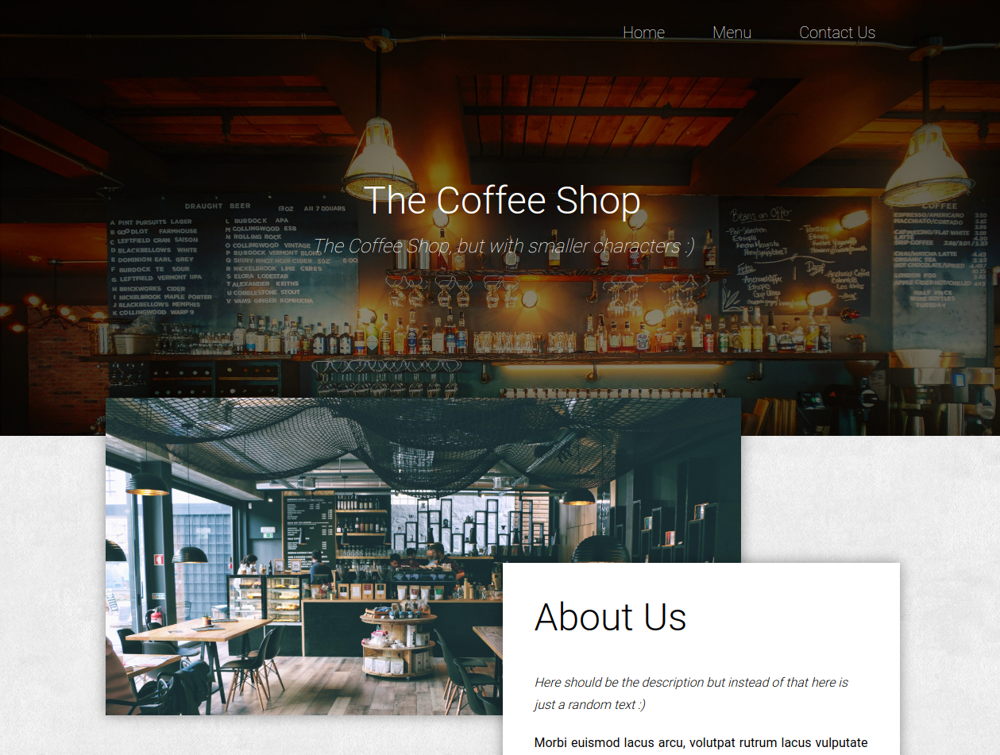

# Restaurant page
This project comes after the introduction of the ES6 class keyword, ES6 modules, and webpack. The main goal of this project is for the student to show the understanding of the benefits of modularized code as well as the ability to set up a javascript application made of different modules using webpack.

You can find the original project specification at: [The Odin Project](https://www.theodinproject.com/courses/javascript/lessons/restaurant-page)

## Built With

- Javascript, HTML, CSS
- Webpack, Sass

## Live Demo

[Live Demo Link](https://raw.githack.com/oscardelalanza/restaurant-page/feature/restaurant/dist/index.html)

## Getting started

This project consists of three sections `Home`, `Menu` and `Contact Us` each one of them can be accessed through the 
`navigation bar` on the `top right` of the site.  

## Authors

👤 **Oscar De La Lanza**

- Github: [@oscardelalanza](https://github.com/oscardelalanza)
- Twitter: [@oscardelalanza](https://twitter.com/oscardelalanza)
- Linkedin: [Oscar De La Lanza](https://www.linkedin.com/in/oscardelalanza/)

## 🤝 Contributing

Contributions, issues and feature requests are welcome!

Feel free to check the [issues page](https://github.com/oscardelalanza/restaurant-page/issues).

## Show your support

Give a ⭐️ if you like this project!
