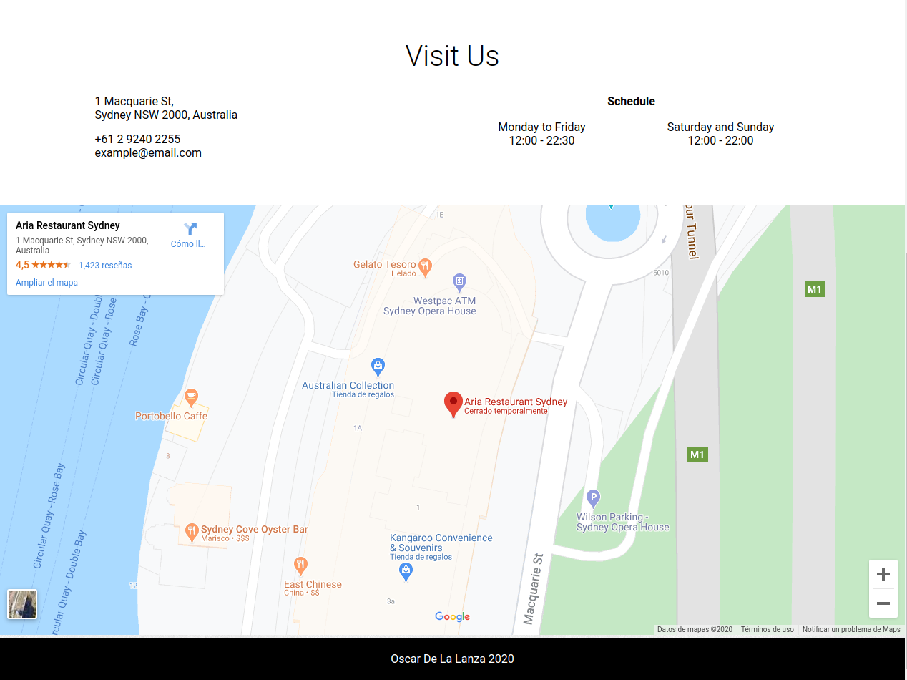

# Restaurant page
> This project comes after the introduction of the ES6 class keyword, ES6 modules, and webpack. The main goal of this
> project is for the student to show the understanding of the benefits of modularized code as well as the ability to set
> up a javascript application made of different modules using webpack.

You can find the original project specification at: [The Odin Project](https://www.theodinproject.com/courses/javascript/lessons/restaurant-page)

## Built With

- Javascript, HTML, CSS
- Webpack, Sass

## Live Demo

[Live Demo Link](https://raw.githack.com/oscardelalanza/restaurant-page/feature/restaurant/dist/index.html)

## Getting started

This project consists of three sections `Home`, `Menu` and `Contact Us` each one of them can be accessed through the 
`navigation bar` on the `top right` of the site (see the image below). 

#### Home
This section can be accessed through the `navigation bar` after clicking the `Home` link. It is used to show the `About Us`
content of the restaurant (in this case it's a simulation).

#### Menu
This section can be accessed through the `navigation bar` after clicking the `Menu` link. It is used to show a simulation
of a restaurant Menu which contains a list of Drinks and a list of Food separated into two different columns. Also, this
section contains a small gallery at the and of the page to show a combination of pictures of drinks, foods and the place itself.

#### Contact Us
This section can be accessed through the `navigation bar` after clicking the `Contact Us` link. It is used to show a simulation
of contact information of a restaurant, including address, phone number, emails, schedule and a map with a mark of the physical
location of the place.

> To get a local copy up and running follow these simple example steps.
 
### Prerequisites

- `npm`
- `git`

### Setup

To clone the project into your local environment do the following

- open a new `terminal` window and navigate to the directory where the project will be stored
- run the command `git clone git@github.com:oscardelalanza/restaurant-page.git`
- run the command `cd restaurant-page` to enter to the project directory

### Install

To install the requires packages do the following

- inside `restaurant-page` directory run the command `npm install`

### Usage

To start the local development server do the following

- run the command `npm run dev` 

### Run tests

- no written tests yet

### Deployment

To build the project do the following

- run the command `npm run build`
 
## Authors

👤 **Oscar De La Lanza**

- Github: [@oscardelalanza](https://github.com/oscardelalanza)
- Twitter: [@oscardelalanza](https://twitter.com/oscardelalanza)
- Linkedin: [Oscar De La Lanza](https://www.linkedin.com/in/oscardelalanza/)

## 🤝 Contributing

Contributions, issues and feature requests are welcome!

Feel free to check the [issues page](https://github.com/oscardelalanza/restaurant-page/issues).

## Show your support

Give a ⭐️ if you like this project!
